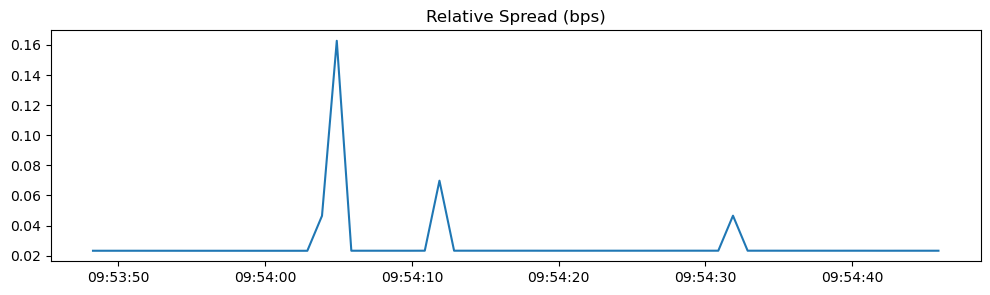
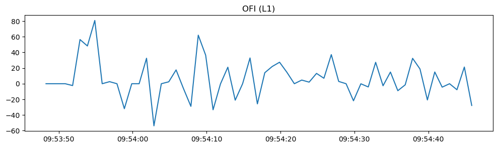
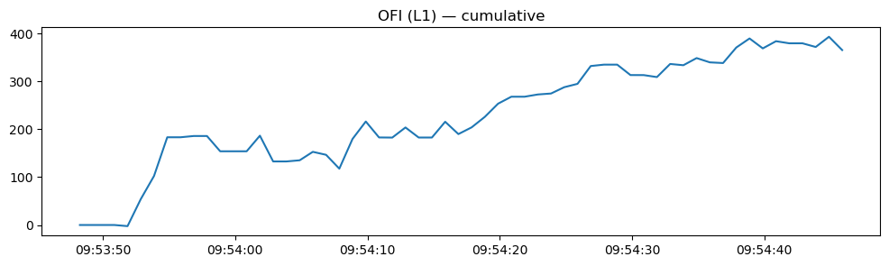
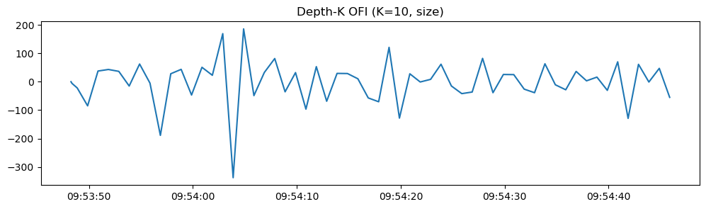
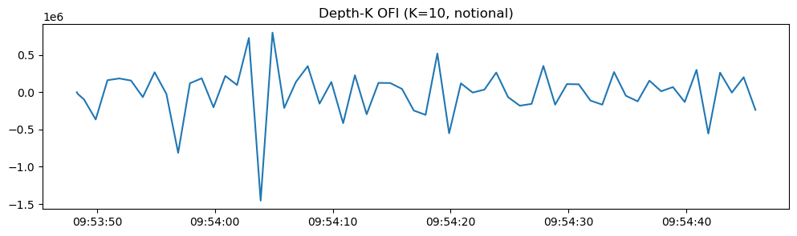
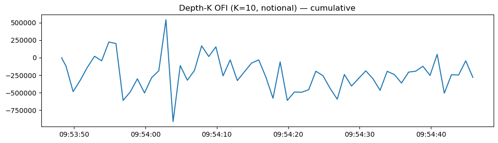
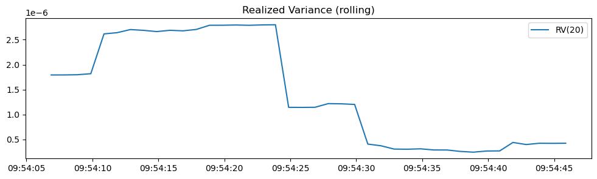

# Market Microstructure Toolkit

Lightweight toolkit to **record crypto order books** and compute core **microstructure features** for research and prototyping.

Built for hands-on learning, reproducible experiments, and quick analysis.

[](LICENSE)  
  


---

## ✨ Features

- **Exchange bootstrap** (ccxt) & symbol checks (spot/swap/future)
- **Normalized snapshots** (L1/L2) → flat, analytics-friendly schema
- **Recorders**
  - REST recorder (fixed Hz)
  - Websocket recorder (ccxt.pro, when available)
  - Robust **writer queue** (no drops) with precise pacing
- **Metrics**: mid, spread, relative spread (bps), microprice, imbalances (L1 & depth-K), realized variance, notional depth, slope/convexity, OFI
- **Plotting CLI**: quick PNGs for common metrics
- **Logging**: runs log to `logs/`
- **Tests**: `pytest` unit tests

---

## Install

```bash
# clone & enter repo
git clone https://github.com/Gruntrexpewrus/market-microstructure-toolkit.git
cd market-microstructure-toolkit

# Conda example
conda create -n mmt python=3.10 -y
conda activate mmt

# Toolkit + dev tools
pip install -e .[dev]

# Optional: Parquet backend
pip install pyarrow    # or fastparquet

# Optional: Websocket capture (commercial)
# pip install ccxtpro
```

# Usage(CLI)
1) Record order books
```bash
# Bybit ETH perpetual, depth 100, 30s @ 2Hz → Parquet
python -m market_microstructure_toolkit.record \
  --exchange bybit \
  --market-type swap \
  --symbol ETH/USDT:USDT \
  --seconds 30 \
  --hz 2 \
  --depth 100 \
  --book-level L2 \
  --format parquet \
  --out data/ETHUSDT_swap_30s.parquet
  ```
  You can also use the console entrypoints installed by the package:
mmt-ws-record, mmt-record, mmt-metrics, mmt-plot.

2) Compute metrics
```bash
python -m market_microstructure_toolkit.metrics_cli data/ETHUSDT_swap_30s.parquet 100
# → writes: data/ETHUSDT_swap_30s_metrics.csv
```

3) One-liner pipeline
```bash
python -m market_microstructure_toolkit.record \
  --exchange bybit --market-type swap \
  --symbol ETH/USDT:USDT --seconds 30 --hz 2 --depth 100 \
  --book-level L2 --format parquet --out data/ETHUSDT_swap_30s.parquet \
&& python -m market_microstructure_toolkit.metrics_cli data/ETHUSDT_swap_30s.parquet 100
```
---

4) Plotting Metrics

The toolkit now includes a **plotting CLI** that visualizes spreads, microprice, OFI, and realized variance directly from recorded CSV/Parquet files.

### Example

```bash
# Record 60s of ETH/USDT order book at depth 100
python -m market_microstructure_toolkit.record \
  --exchange bybit --market-type swap \
  --symbol ETH/USDT:USDT --seconds 60 --hz 1 --depth 100 \
  --book-level L2 --format parquet --out data/ETH_bybit_L2_60s.parquet

# Plot metrics (saves PNGs in the same folder)
python -m market_microstructure_toolkit.plot_cli data/ETH_bybit_L2_60s.parquet --depth 100 --save
# → saves PNGs into: plots/ETH_bybit_L2_60s/
```
### Mid vs Microprice
Captures the mid-quote vs microprice (liquidity-weighted mid).  


### Relative Spread (bps)
Spread relative to midprice (basis points).  


### Order Flow Imbalance (L1)
Flow imbalance from the best bid/ask sizes (instantaneous and cumulative).  
  


### Depth-K OFI (K=10)
Order flow imbalance measured across top-10 levels (size-based and notional).  
  
  
  


### Realized Variance
Rolling realized variance of midprice (RV-20).  



### CSV Schema
```bash
ts_ms, iso, exchange_id, symbol, book_level, raw_nonce, best_bid, best_ask,
bid1_price, bid1_size, ... bidK_price, bidK_size,
ask1_price, ask1_size, ... askK_price, askK_size
	•	Numeric fields use 10 decimals; missing levels are blank.
	•	ts_ms is producer timestamp (ms); iso is UTC.
```
# format + lint
pre-commit run --all-files

# run tests
pytest -q

### Dev Workflow 

```bash
# quick smoke: record 5s @ 2Hz depth=5 (REST or WS)
python -m market_microstructure_toolkit.ws_record \
  --exchange bybit --symbol ETH/USDT:USDT --depth 5 --seconds 5 --hz 2
python -m market_microstructure_toolkit.metrics_cli data/ws_bybit_*_d5_5s_2hz.csv 5
python -m market_microstructure_toolkit.plot_cli data/ws_bybit_*_d5_5s_2hz.csv --depth 5 --save
```

## Roadmap

Phase 1 (done):
✅ Exchange bootstrap & symbol checks
✅ Normalized snapshots (L1/L2)
✅ Recorder (CSV/Parquet)
✅ Metrics: spread, mid, imbalance (L1, depth-K)

Phase 2 (done/ongoing):
✅ Relative spread (bps)
✅ Microprice & microprice imbalance
✅ Rolling realized variance & volatility proxies
✅ Notional depth, slope/convexity
✅ OFI variants (L1, depth-K)
✅ Plotting CLI

Phase 3 (next):
⬜ Event-time metrics (per book update)
⬜ Advanced visualization & analytics
⬜ Market impact helpers (VWAP/TWAP)
⬜ Packaging polish (wheels, PyPI)
⬜ More console_scripts entry points

---

## License

MIT License – see [LICENSE](LICENSE) for details.

---

## Contact

- 📧 Email: leonardoplacidi@gmail.com  
- 💼 LinkedIn: [Leonardo Placidi](https://www.linkedin.com/in/leonardo-p-570616198/)  
